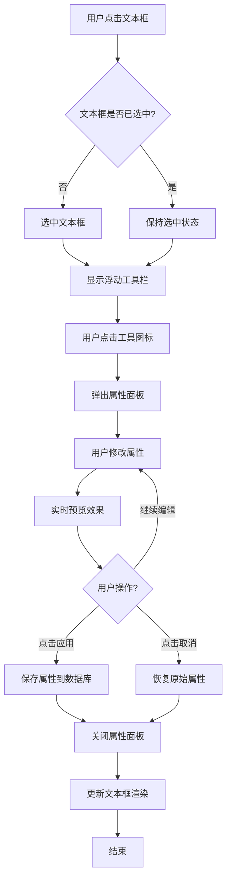

# 文本框浮动工具栏技术框架设计文档

> **项目名称**: Canvas Cast 文本编辑器  
> **文档版本**: v1.0  
> **创建日期**: 2025-11-02  
> **技术栈**: WPF + SkiaSharp + MVVM

---

## 📋 目录

1. [架构概述](#架构概述)
2. [组件设计](#组件设计)
3. [交互流程](#交互流程)
4. [数据模型](#数据模型)
5. [实现方案](#实现方案)
6. [代码示例](#代码示例)
7. [扩展性设计](#扩展性设计)

---

## 🏗️ 架构概述

### 设计目标

实现类似专业设计软件（Figma、Canva）的文本编辑体验：
- ✅ 点击文本框时，显示浮动工具栏
- ✅ 点击工具图标，弹出属性编辑面板
- ✅ 实时预览编辑效果
- ✅ 支持边框、背景、文字、特效等多种属性

### 架构层次

```
┌─────────────────────────────────────────────────────────┐
│                    UI 交互层                              │
│  ┌──────────────┐  ┌──────────────┐  ┌──────────────┐  │
│  │ 文本框控件    │  │ 浮动工具栏    │  │ 属性面板      │  │
│  │ SkiaTextBox  │  │FloatingToolbar│  │PropertyPanel │  │
│  └──────────────┘  └──────────────┘  └──────────────┘  │
└─────────────────────────────────────────────────────────┘
                          ↕
┌─────────────────────────────────────────────────────────┐
│                   ViewModel 层                           │
│  ┌──────────────────────────────────────────────────┐  │
│  │         TextBoxViewModel (MVVM)                   │  │
│  │  - BorderProperties (边框属性)                     │  │
│  │  - BackgroundProperties (背景属性)                 │  │
│  │  - TextProperties (文字属性)                       │  │
│  │  - EffectProperties (特效属性)                     │  │
│  └──────────────────────────────────────────────────┘  │
└─────────────────────────────────────────────────────────┘
                          ↕
┌─────────────────────────────────────────────────────────┐
│                   渲染层 (SkiaSharp)                     │
│  ┌──────────────────────────────────────────────────┐  │
│  │         SkiaTextRenderer                          │  │
│  │  - RenderBorder() (渲染边框)                       │  │
│  │  - RenderBackground() (渲染背景)                   │  │
│  │  - RenderText() (渲染文字)                         │  │
│  │  - RenderEffects() (渲染特效)                      │  │
│  └──────────────────────────────────────────────────┘  │
└─────────────────────────────────────────────────────────┘
                          ↕
┌─────────────────────────────────────────────────────────┐
│                   数据持久化层                            │
│  ┌──────────────────────────────────────────────────┐  │
│  │         TextElement (Entity Framework)            │  │
│  │  - 存储到 SQLite 数据库                            │  │
│  └──────────────────────────────────────────────────┘  │
└─────────────────────────────────────────────────────────┘
```

---

## 🧩 组件设计

### 1. SkiaTextBox（文本框控件）

**职责**：
- 渲染文本内容和样式
- 处理鼠标交互（选中、拖拽、缩放）
- 触发浮动工具栏显示

**关键属性**：
```csharp
public class SkiaTextBox : SKElement
{
    // 基础属性
    public string Text { get; set; }
    public float FontSize { get; set; }
    public SKColor TextColor { get; set; }
    
    // 边框属性
    public BorderProperties Border { get; set; }
    
    // 背景属性
    public BackgroundProperties Background { get; set; }
    
    // 特效属性
    public EffectProperties Effects { get; set; }
    
    // 状态
    public bool IsSelected { get; set; }
    public bool IsEditing { get; set; }
}
```

---

### 2. FloatingToolbar（浮动工具栏）

**职责**：
- 在文本框选中时显示
- 提供快捷操作图标
- 触发属性面板弹出

**UI 结构**：
```
┌─────────────────────────────────────────────┐
│  🎨  📐  🖼️  ✨  🔤  📏  🎭  ⚙️          │  ← 工具图标
└─────────────────────────────────────────────┘
  │    │    │    │    │    │    │    │
  边框 背景 图片 特效 文字 对齐 图层 设置
```

**实现方式**：
- 使用 WPF `Popup` 或 `Adorner`
- 自动定位到文本框上方/下方
- 支持拖拽移动

---

### 3. PropertyPanel（属性面板）

**职责**：
- 显示详细的属性编辑控件
- 实时预览效果
- 支持撤销/重做

**面板类型**：

#### 3.1 边框属性面板（BorderPropertyPanel）

```
┌─────────────────────────────────┐
│  边框设置                        │
├─────────────────────────────────┤
│  颜色:  [████████] #3498db      │
│  透明度: [━━━━━━━━━━] 100%      │
│  宽度:  [━━━━━━━━━━] 2px        │
│  圆角:  [━━━━━━━━━━] 20px       │
│  样式:  [实线 ▼]                │
├─────────────────────────────────┤
│  [预览]  [应用]  [取消]          │
└─────────────────────────────────┘
```

#### 3.2 背景属性面板（BackgroundPropertyPanel）

```
┌─────────────────────────────────┐
│  背景设置                        │
├─────────────────────────────────┤
│  类型:  ⚪ 纯色  ⚫ 渐变  ⚪ 图片 │
│  颜色:  [████████] #2ecc71      │
│  透明度: [━━━━━━━━━━] 80%       │
│  模糊:  [━━━━━━━━━━] 0px        │
├─────────────────────────────────┤
│  渐变设置 (可选)                 │
│  起始色: [████████] #3498db     │
│  结束色: [████████] #9b59b6     │
│  角度:  [━━━━━━━━━━] 45°        │
├─────────────────────────────────┤
│  [预览]  [应用]  [取消]          │
└─────────────────────────────────┘
```

#### 3.3 文字属性面板（TextPropertyPanel）

```
┌─────────────────────────────────┐
│  文字设置                        │
├─────────────────────────────────┤
│  字体:  [Microsoft YaHei ▼]     │
│  字号:  [━━━━━━━━━━] 20px       │
│  颜色:  [████████] #ffffff      │
│  字间距: [━━━━━━━━━━] 0px       │
│  行间距: [━━━━━━━━━━] 1.5       │
│  对齐:  [左] [中] [右] [两端]    │
│  样式:  [B] [I] [U] [S]         │
├─────────────────────────────────┤
│  [预览]  [应用]  [取消]          │
└─────────────────────────────────┘
```

#### 3.4 特效属性面板（EffectPropertyPanel）

```
┌─────────────────────────────────┐
│  特效设置                        │
├─────────────────────────────────┤
│  ☑ 阴影                         │
│    颜色:  [████████] #000000    │
│    偏移X: [━━━━━━━━━━] 2px      │
│    偏移Y: [━━━━━━━━━━] 2px      │
│    模糊:  [━━━━━━━━━━] 4px      │
│                                 │
│  ☑ 描边                         │
│    颜色:  [████████] #000000    │
│    宽度:  [━━━━━━━━━━] 2px      │
│                                 │
│  ☐ 发光                         │
│  ☐ 模糊                         │
├─────────────────────────────────┤
│  [预览]  [应用]  [取消]          │
└─────────────────────────────────┘
```

---

## 🔄 交互流程

### 流程图



### 详细步骤

#### 步骤 1：选中文本框
```csharp
// 用户点击文本框
private void OnTextBoxMouseDown(object sender, MouseButtonEventArgs e)
{
    // 1. 取消其他文本框的选中状态
    DeselectAllTextBoxes();
    
    // 2. 选中当前文本框
    var textBox = sender as SkiaTextBox;
    textBox.IsSelected = true;
    
    // 3. 显示浮动工具栏
    ShowFloatingToolbar(textBox);
}
```

#### 步骤 2：显示浮动工具栏
```csharp
private void ShowFloatingToolbar(SkiaTextBox textBox)
{
    // 1. 创建或获取浮动工具栏
    if (_floatingToolbar == null)
    {
        _floatingToolbar = new FloatingToolbar();
        _floatingToolbar.ToolClicked += OnToolClicked;
    }
    
    // 2. 计算工具栏位置（文本框上方）
    var position = CalculateToolbarPosition(textBox);
    
    // 3. 显示工具栏
    _floatingToolbar.Show(position);
}
```

#### 步骤 3：弹出属性面板
```csharp
private void OnToolClicked(object sender, ToolClickedEventArgs e)
{
    switch (e.ToolType)
    {
        case ToolType.Border:
            ShowBorderPropertyPanel();
            break;
        case ToolType.Background:
            ShowBackgroundPropertyPanel();
            break;
        case ToolType.Text:
            ShowTextPropertyPanel();
            break;
        case ToolType.Effects:
            ShowEffectPropertyPanel();
            break;
    }
}
```

#### 步骤 4：实时预览
```csharp
// 属性面板中的滑块变化事件
private void OnBorderWidthChanged(object sender, RoutedPropertyChangedEventArgs<double> e)
{
    // 1. 更新 ViewModel
    _viewModel.Border.Width = (float)e.NewValue;
    
    // 2. 触发文本框重绘（实时预览）
    _selectedTextBox.InvalidateVisual();
}
```

---

## 📦 数据模型

### BorderProperties（边框属性）

```csharp
public class BorderProperties : INotifyPropertyChanged
{
    private SKColor _color = SKColors.Black;
    private float _opacity = 1.0f;
    private float _width = 2.0f;
    private float _cornerRadius = 0.0f;
    private BorderStyle _style = BorderStyle.Solid;
    
    public SKColor Color
    {
        get => _color;
        set { _color = value; OnPropertyChanged(); }
    }
    
    public float Opacity
    {
        get => _opacity;
        set { _opacity = Math.Clamp(value, 0f, 1f); OnPropertyChanged(); }
    }
    
    public float Width
    {
        get => _width;
        set { _width = Math.Max(0, value); OnPropertyChanged(); }
    }
    
    public float CornerRadius
    {
        get => _cornerRadius;
        set { _cornerRadius = Math.Max(0, value); OnPropertyChanged(); }
    }
    
    public BorderStyle Style
    {
        get => _style;
        set { _style = value; OnPropertyChanged(); }
    }
    
    public event PropertyChangedEventHandler PropertyChanged;
    protected void OnPropertyChanged([CallerMemberName] string name = null)
    {
        PropertyChanged?.Invoke(this, new PropertyChangedEventArgs(name));
    }
}

public enum BorderStyle
{
    Solid,      // 实线
    Dashed,     // 虚线
    Dotted,     // 点线
    Double      // 双线
}
```

### BackgroundProperties（背景属性）

```csharp
public class BackgroundProperties : INotifyPropertyChanged
{
    private BackgroundType _type = BackgroundType.SolidColor;
    private SKColor _color = SKColors.Transparent;
    private float _opacity = 1.0f;
    private float _blur = 0.0f;
    
    // 渐变属性
    private SKColor _gradientStartColor = SKColors.Blue;
    private SKColor _gradientEndColor = SKColors.Purple;
    private float _gradientAngle = 0.0f;
    
    public BackgroundType Type { get; set; }
    public SKColor Color { get; set; }
    public float Opacity { get; set; }
    public float Blur { get; set; }
    
    // 渐变
    public SKColor GradientStartColor { get; set; }
    public SKColor GradientEndColor { get; set; }
    public float GradientAngle { get; set; }
    
    // 图片
    public string ImagePath { get; set; }
}

public enum BackgroundType
{
    None,           // 无背景
    SolidColor,     // 纯色
    Gradient,       // 渐变
    Image           // 图片
}
```

### TextElement（数据库实体扩展）

```csharp
// 扩展现有的 TextElement 模型
public partial class TextElement
{
    // 边框属性（JSON 序列化）
    [Column("border_properties")]
    public string BorderPropertiesJson { get; set; }
    
    [NotMapped]
    public BorderProperties Border
    {
        get => string.IsNullOrEmpty(BorderPropertiesJson) 
            ? new BorderProperties() 
            : JsonSerializer.Deserialize<BorderProperties>(BorderPropertiesJson);
        set => BorderPropertiesJson = JsonSerializer.Serialize(value);
    }
    
    // 背景属性（JSON 序列化）
    [Column("background_properties")]
    public string BackgroundPropertiesJson { get; set; }
    
    [NotMapped]
    public BackgroundProperties Background
    {
        get => string.IsNullOrEmpty(BackgroundPropertiesJson) 
            ? new BackgroundProperties() 
            : JsonSerializer.Deserialize<BackgroundProperties>(BackgroundPropertiesJson);
        set => BackgroundPropertiesJson = JsonSerializer.Serialize(value);
    }
}
```

---

## 🛠️ 实现方案

### 方案 1：使用 WPF Popup（推荐）

**优点**：
- ✅ 原生 WPF 控件，稳定可靠
- ✅ 自动处理窗口边界
- ✅ 支持动画效果

**实现**：
```csharp
public class FloatingToolbar : Popup
{
    private StackPanel _toolPanel;
    
    public FloatingToolbar()
    {
        // 创建工具栏内容
        _toolPanel = new StackPanel
        {
            Orientation = Orientation.Horizontal,
            Background = new SolidColorBrush(Color.FromArgb(230, 50, 50, 50)),
            Margin = new Thickness(5)
        };
        
        // 添加工具按钮
        AddToolButton("🎨", ToolType.Border, "边框");
        AddToolButton("🖼️", ToolType.Background, "背景");
        AddToolButton("🔤", ToolType.Text, "文字");
        AddToolButton("✨", ToolType.Effects, "特效");
        
        Child = _toolPanel;
        StaysOpen = false;
        AllowsTransparency = true;
    }
    
    private void AddToolButton(string icon, ToolType type, string tooltip)
    {
        var button = new Button
        {
            Content = icon,
            Width = 40,
            Height = 40,
            Margin = new Thickness(2),
            ToolTip = tooltip,
            Tag = type
        };
        
        button.Click += (s, e) => OnToolClicked(type);
        _toolPanel.Children.Add(button);
    }
}
```

### 方案 2：使用 Adorner Layer

**优点**：
- ✅ 更灵活的定位
- ✅ 可以覆盖在任何控件上
- ✅ 支持复杂的视觉效果

**实现**：
```csharp
public class FloatingToolbarAdorner : Adorner
{
    private VisualCollection _visuals;
    private ContentPresenter _presenter;
    
    public FloatingToolbarAdorner(UIElement adornedElement) : base(adornedElement)
    {
        _visuals = new VisualCollection(this);
        
        // 创建工具栏内容
        var toolbar = CreateToolbar();
        _presenter = new ContentPresenter { Content = toolbar };
        _visuals.Add(_presenter);
    }
    
    protected override Visual GetVisualChild(int index) => _visuals[index];
    protected override int VisualChildrenCount => _visuals.Count;
    
    protected override Size ArrangeOverride(Size finalSize)
    {
        // 定位工具栏到文本框上方
        var desiredSize = _presenter.DesiredSize;
        var x = (finalSize.Width - desiredSize.Width) / 2;
        var y = -desiredSize.Height - 10;
        
        _presenter.Arrange(new Rect(new Point(x, y), desiredSize));
        return finalSize;
    }
}
```

---

## 💻 代码示例

### 完整示例：边框编辑流程

```csharp
// 1. 用户点击边框工具图标
private void OnBorderToolClicked()
{
    // 创建边框属性面板
    var panel = new BorderPropertyPanel
    {
        DataContext = _selectedTextBox.Border
    };
    
    // 订阅属性变化事件（实时预览）
    panel.PropertyChanged += (s, e) =>
    {
        _selectedTextBox.InvalidateVisual();
    };
    
    // 显示面板
    ShowPropertyPanel(panel);
}

// 2. 边框属性面板 XAML
/*
<UserControl x:Class="BorderPropertyPanel">
    <StackPanel Margin="10">
        <TextBlock Text="边框设置" FontSize="16" FontWeight="Bold"/>
        
        <!-- 颜色选择器 -->
        <StackPanel Margin="0,10,0,0">
            <TextBlock Text="颜色"/>
            <ColorPicker SelectedColor="{Binding Color, Mode=TwoWay}"/>
        </StackPanel>
        
        <!-- 透明度滑块 -->
        <StackPanel Margin="0,10,0,0">
            <TextBlock Text="透明度"/>
            <Slider Minimum="0" Maximum="1" Value="{Binding Opacity, Mode=TwoWay}"
                    ValueChanged="OnOpacityChanged"/>
        </StackPanel>
        
        <!-- 宽度滑块 -->
        <StackPanel Margin="0,10,0,0">
            <TextBlock Text="宽度"/>
            <Slider Minimum="0" Maximum="20" Value="{Binding Width, Mode=TwoWay}"
                    ValueChanged="OnWidthChanged"/>
        </StackPanel>
        
        <!-- 圆角滑块 -->
        <StackPanel Margin="0,10,0,0">
            <TextBlock Text="圆角"/>
            <Slider Minimum="0" Maximum="50" Value="{Binding CornerRadius, Mode=TwoWay}"
                    ValueChanged="OnCornerRadiusChanged"/>
        </StackPanel>
        
        <!-- 按钮 -->
        <StackPanel Orientation="Horizontal" Margin="0,20,0,0">
            <Button Content="应用" Click="OnApplyClicked"/>
            <Button Content="取消" Click="OnCancelClicked"/>
        </StackPanel>
    </StackPanel>
</UserControl>
*/

// 3. SkiaSharp 渲染边框
private void RenderBorder(SKCanvas canvas, BorderProperties border)
{
    if (border.Width <= 0)
        return;
    
    using var paint = new SKPaint
    {
        Style = SKPaintStyle.Stroke,
        Color = border.Color.WithAlpha((byte)(border.Opacity * 255)),
        StrokeWidth = border.Width,
        IsAntialias = true
    };
    
    // 根据样式设置虚线效果
    if (border.Style == BorderStyle.Dashed)
    {
        paint.PathEffect = SKPathEffect.CreateDash(new[] { 10f, 5f }, 0);
    }
    else if (border.Style == BorderStyle.Dotted)
    {
        paint.PathEffect = SKPathEffect.CreateDash(new[] { 2f, 2f }, 0);
    }
    
    // 绘制圆角矩形
    var rect = new SKRect(0, 0, Width, Height);
    canvas.DrawRoundRect(rect, border.CornerRadius, border.CornerRadius, paint);
}
```

---

## 🔌 扩展性设计

### 插件化工具系统

```csharp
// 工具接口
public interface ITool
{
    string Name { get; }
    string Icon { get; }
    ToolType Type { get; }
    
    UserControl CreatePropertyPanel();
    void Apply(SkiaTextBox textBox);
}

// 工具管理器
public class ToolManager
{
    private Dictionary<ToolType, ITool> _tools = new();
    
    public void RegisterTool(ITool tool)
    {
        _tools[tool.Type] = tool;
    }
    
    public ITool GetTool(ToolType type)
    {
        return _tools.TryGetValue(type, out var tool) ? tool : null;
    }
}

// 使用示例
var toolManager = new ToolManager();
toolManager.RegisterTool(new BorderTool());
toolManager.RegisterTool(new BackgroundTool());
toolManager.RegisterTool(new TextTool());
toolManager.RegisterTool(new EffectTool());
```

---

## 📝 总结

### 核心优势

1. **模块化设计**：工具栏、属性面板、渲染器独立解耦
2. **实时预览**：MVVM 数据绑定 + SkiaSharp 高性能渲染
3. **可扩展性**：插件化工具系统，易于添加新功能
4. **用户体验**：类似专业设计软件的交互流程

### 技术亮点

- ✅ WPF + SkiaSharp 混合架构
- ✅ MVVM 模式管理状态
- ✅ JSON 序列化存储复杂属性
- ✅ 实时预览 + 撤销/重做支持

---

**文档维护者**: Canvas Cast Team  
**最后更新**: 2025-11-02

