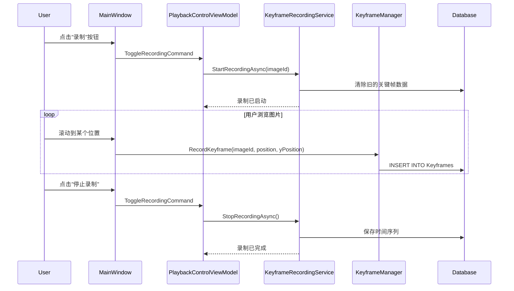
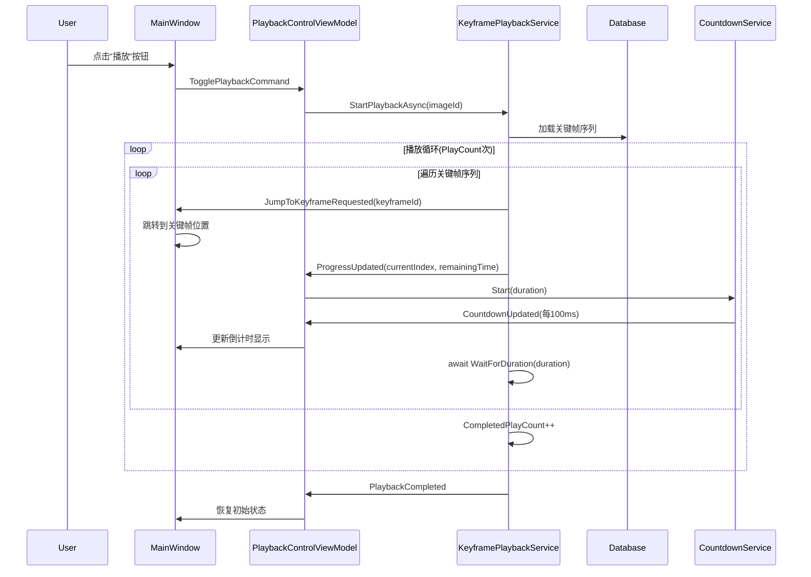
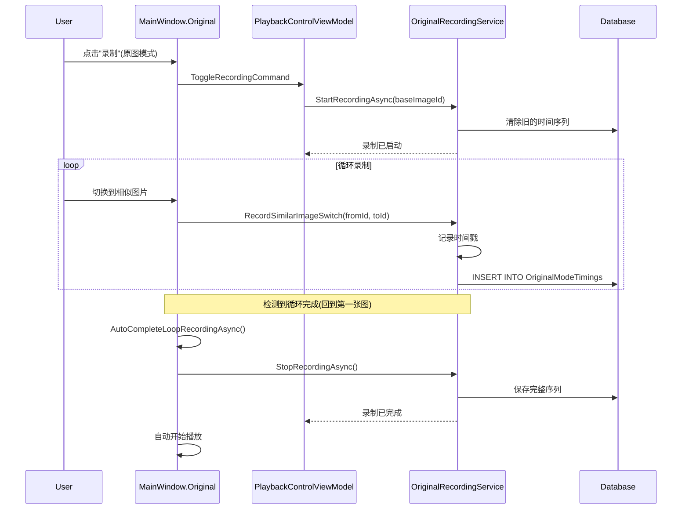
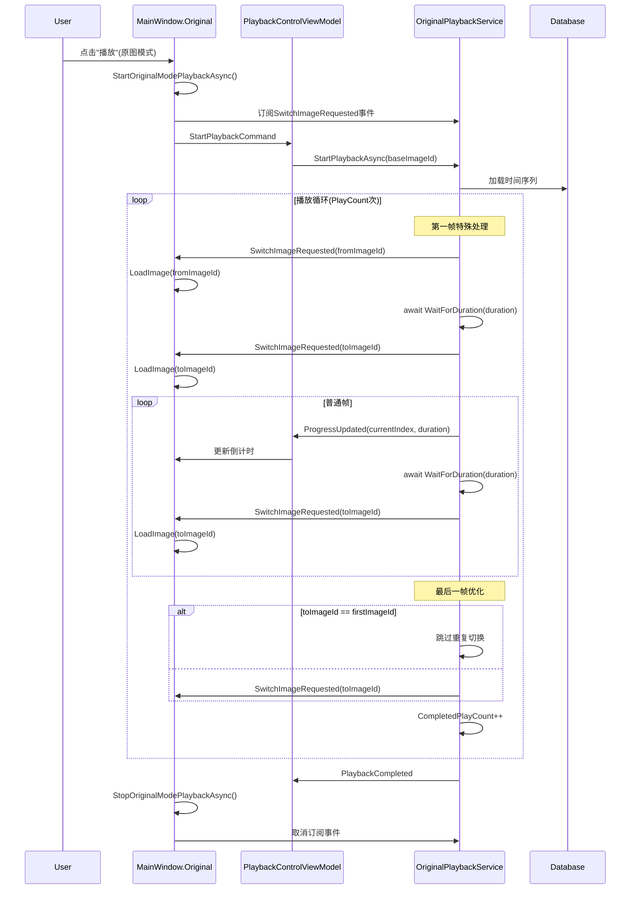
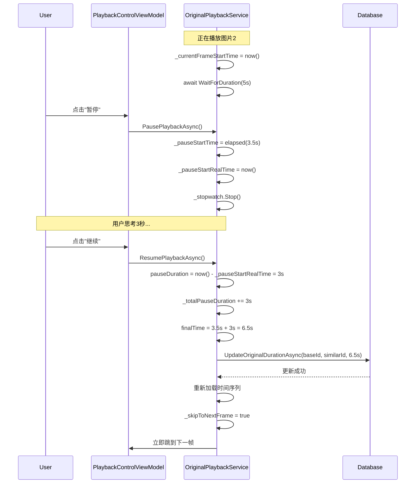
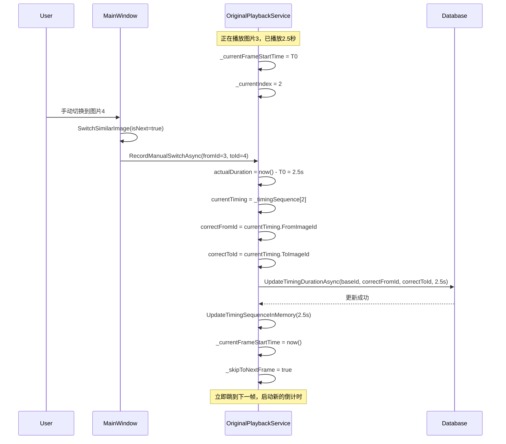

# Canvas Cast 系统架构文档

> **版本**：2.5.5  
> **技术栈**：WPF + .NET 8.0 + Entity Framework Core + SQLite  
> **项目类型**：专业图片浏览与管理工具  
> **文档生成时间**：2025-10-13

---

## 📋 目录

1. [项目概述](#项目概述)
2. [技术架构](#技术架构)
3. [目录结构](#目录结构)
4. [核心模块](#核心模块)
5. [数据库设计](#数据库设计)
6. [服务层架构](#服务层架构)
7. [业务逻辑流程](#业务逻辑流程)
8. [调用关系图](#调用关系图)
9. [扩展指南](#扩展指南)

---

## 📌 项目概述

### 1.1 项目定位

**Canvas Cast** 是一个专业的 WPF 桌面应用程序，主要用于：
- **图片浏览和管理**：支持大量图片的快速浏览和组织
- **关键帧播放**：支持图片序列的关键帧录制和自动播放
- **原图模式**：支持相似图片的智能切换和时间管理
- **投影功能**：支持多屏幕投影显示
- **视频播放**：集成LibVLC支持视频媒体播放
- **GPU加速**：使用ComputeSharp实现高性能图像处理

### 1.2 核心特性

| 功能模块 | 描述 | 技术实现 |
|---------|------|---------|
| **关键帧模式** | 记录图片浏览序列，支持自动播放和循环 | KeyframePlaybackService + KeyframeRecordingService |
| **原图模式** | 智能识别相似图片，自动切换播放 | OriginalPlaybackService + OriginalRecordingService |
| **时间管理** | 支持暂停时间累加、手动跳转时间修正 | PauseTimeAccumulator + 实时时间计算 |
| **多屏投影** | 支持将图片投影到第二屏幕 | ProjectionManager + WPF多窗口 |
| **GPU处理** | GPU加速的图像渲染和色彩处理 | ComputeSharp + Direct2D |
| **数据持久化** | SQLite数据库存储所有配置和记录 | Entity Framework Core |

### 1.3 依赖包

```xml
<!-- 核心框架 -->
<PackageReference Include="Microsoft.NETCore.App" Version="8.0" />

<!-- UI框架 -->
<PackageReference Include="MaterialDesignThemes" Version="5.1.0" />
<PackageReference Include="MaterialDesignColors" Version="3.1.0" />

<!-- 数据库 -->
<PackageReference Include="Microsoft.EntityFrameworkCore.Sqlite" Version="8.0.0" />
<PackageReference Include="EFCore.BulkExtensions" Version="8.1.1" />

<!-- 图像处理 -->
<PackageReference Include="SixLabors.ImageSharp" Version="3.1.7" />
<PackageReference Include="ComputeSharp" Version="3.2.0" />

<!-- 视频播放 -->
<PackageReference Include="LibVLCSharp" Version="3.8.5" />
<PackageReference Include="VideoLAN.LibVLC.Windows" Version="3.0.20" />

<!-- 依赖注入 -->
<PackageReference Include="Microsoft.Extensions.DependencyInjection" Version="8.0.0" />
<PackageReference Include="CommunityToolkit.Mvvm" Version="8.2.2" />
```

---

## 🏗️ 技术架构

### 2.1 整体架构

```
┌─────────────────────────────────────────────────────────────┐
│                        Presentation Layer                    │
│  ┌──────────────┐  ┌──────────────┐  ┌──────────────┐      │
│  │  MainWindow  │  │  ViewModels  │  │   Controls   │      │
│  │   (XAML)     │  │    (MVVM)    │  │ (ScriptEdit) │      │
│  └──────────────┘  └──────────────┘  └──────────────┘      │
└───────────────────────────┬─────────────────────────────────┘
                            │
┌───────────────────────────┴─────────────────────────────────┐
│                        Business Layer                        │
│  ┌─────────────┐  ┌─────────────┐  ┌─────────────┐         │
│  │  Managers   │  │  Services   │  │ Algorithms  │         │
│  │ (业务管理器) │  │ (播放/录制)  │  │ (算法逻辑)  │         │
│  └─────────────┘  └─────────────┘  └─────────────┘         │
└───────────────────────────┬─────────────────────────────────┘
                            │
┌───────────────────────────┴─────────────────────────────────┐
│                         Data Layer                           │
│  ┌─────────────┐  ┌─────────────┐  ┌─────────────┐         │
│  │Repositories │  │  DbContext  │  │   Models    │         │
│  │ (数据访问)   │  │    (EF)     │  │  (实体)     │         │
│  └─────────────┘  └─────────────┘  └─────────────┘         │
└───────────────────────────┬─────────────────────────────────┘
                            │
                    ┌───────┴────────┐
                    │  SQLite 数据库  │
                    │  pyimages.db   │
                    └────────────────┘
```

### 2.2 设计模式

| 模式 | 应用场景 | 实现位置 |
|-----|---------|---------|
| **MVVM** | UI层与业务层分离 | ViewModels + MainWindow |
| **Repository** | 数据访问抽象 | Repositories/ |
| **Factory** | 服务创建和管理 | PlaybackServiceFactory |
| **Dependency Injection** | 依赖注入和控制反转 | ServiceCollectionExtensions |
| **State Machine** | 播放状态管理 | PlaybackStateMachine |
| **Strategy** | 不同播放模式切换 | IPlaybackService接口 |
| **Observer** | 事件驱动通信 | Event事件系统 |

### 2.3 架构原则

1. **单一职责**：每个类只负责一个功能
2. **依赖倒置**：高层模块不依赖低层模块，都依赖抽象
3. **接口隔离**：使用接口定义服务契约
4. **开闭原则**：对扩展开放，对修改关闭

---

## 📁 目录结构

### 3.1 C# 项目结构

```
CCanvas/
├── App.xaml / App.xaml.cs           # 应用程序入口
├── Core/                            # 核心基础设施
│   ├── ConfigManager.cs             # 配置管理
│   ├── Constants.cs                 # 常量定义
│   ├── GPUProcessor.cs              # GPU处理器
│   ├── ImageProcessor.cs            # 图像处理
│   └── ServiceCollectionExtensions.cs # DI注册
├── Database/                        # 数据库层
│   ├── CanvasDbContext.cs           # EF Core上下文
│   ├── DatabaseManager.cs           # 数据库管理器
│   └── Models/                      # 数据模型
│       ├── DTOs/                    # 数据传输对象
│       │   ├── KeyframeSequenceDto.cs
│       │   ├── OriginalTimingSequenceDto.cs
│       │   └── ...
│       ├── Enums/                   # 枚举类型
│       │   ├── PlaybackMode.cs      # 播放模式
│       │   ├── PlaybackStatus.cs    # 播放状态
│       │   ├── LocationType.cs      # 位置类型
│       │   └── ...
│       ├── Folder.cs                # 文件夹实体
│       ├── MediaFile.cs             # 媒体文件实体
│       ├── Keyframe.cs              # 关键帧实体
│       ├── KeyframeTiming.cs        # 关键帧时间记录
│       ├── OriginalMark.cs          # 原图标记
│       ├── OriginalModeTiming.cs    # 原图时间记录
│       └── Setting.cs               # 设置实体
├── Repositories/                    # 仓储层
│   ├── Interfaces/                  # 仓储接口
│   │   ├── IRepository.cs
│   │   ├── IKeyframeRepository.cs
│   │   ├── ITimingRepository.cs
│   │   ├── IOriginalModeRepository.cs
│   │   └── IMediaFileRepository.cs
│   └── Implementations/             # 仓储实现
│       ├── RepositoryBase.cs        # 仓储基类
│       ├── KeyframeRepositoryImpl.cs
│       ├── TimingRepository.cs
│       ├── OriginalModeRepositoryImpl.cs
│       └── MediaFileRepositoryImpl.cs
├── Services/                        # 服务层
│   ├── Interfaces/                  # 服务接口
│   │   ├── IPlaybackService.cs      # 播放服务接口
│   │   ├── IRecordingService.cs     # 录制服务接口
│   │   └── ICountdownService.cs     # 倒计时服务接口
│   ├── Implementations/             # 服务实现
│   │   ├── KeyframePlaybackService.cs    # 关键帧播放
│   │   ├── KeyframeRecordingService.cs   # 关键帧录制
│   │   ├── OriginalPlaybackService.cs    # 原图播放
│   │   ├── OriginalRecordingService.cs   # 原图录制
│   │   └── CountdownService.cs           # 倒计时服务
│   ├── Algorithms/                  # 算法模块
│   │   ├── PauseTimeAccumulator.cs  # 暂停时间累加
│   │   ├── PlayCountJudge.cs        # 播放次数判断
│   │   └── SmartJumpDecider.cs      # 智能跳转决策
│   ├── StateMachine/                # 状态机
│   │   └── PlaybackStateMachine.cs  # 播放状态机
│   └── PlaybackServiceFactory.cs    # 服务工厂
├── Managers/                        # 业务管理器
│   ├── Keyframes/                   # 关键帧管理
│   │   ├── KeyframeManager.cs       # 关键帧管理器
│   │   ├── KeyframeNavigator.cs     # 关键帧导航
│   │   └── KeyframeRepository.cs    # 关键帧仓储(旧)
│   ├── ImportManager.cs             # 导入管理器
│   ├── OriginalManager.cs           # 原图管理器
│   ├── ProjectionManager.cs         # 投影管理器
│   ├── SearchManager.cs             # 搜索管理器
│   ├── SortManager.cs               # 排序管理器
│   ├── VideoPlayerManager.cs        # 视频播放器管理
│   └── ImageSaveManager.cs          # 图片保存管理
├── ViewModels/                      # 视图模型
│   ├── ViewModelBase.cs             # ViewModel基类
│   └── PlaybackControlViewModel.cs # 播放控制ViewModel
├── UI/                              # 用户界面
│   ├── MainWindow.xaml              # 主窗口界面
│   ├── MainWindow.xaml.cs           # 主窗口逻辑
│   ├── MainWindow.Keyframe.cs       # 关键帧模式扩展
│   ├── MainWindow.Original.cs       # 原图模式扩展
│   ├── ScriptEditWindow.xaml        # 脚本编辑窗口
│   └── ScriptEditWindow.xaml.cs     # 脚本编辑逻辑
└── Utils/                           # 工具类
    ├── Logger.cs                    # 日志工具
    ├── ImageCache.cs                # 图片缓存
    ├── AnimationHelper.cs           # 动画辅助
    └── EasingFunctions.cs           # 缓动函数
```

### 3.2 Python 参考项目（Canvas/）

```
Canvas/                              # Python版本参考代码
├── main.py                          # 主入口
├── config/                          # 配置模块
├── core/                            # 核心功能
├── database/                        # 数据库管理
├── keyframes/                       # 关键帧功能
├── managers/                        # 业务管理器
├── playback/                        # 播放控制
│   ├── keytime.py                   # 关键帧和原图播放逻辑
│   └── playback_controller.py       # 播放控制器
├── projection/                      # 投影功能
├── ui/                              # UI组件
└── palysdocs/                       # 逻辑分析文档
    ├── LOGIC_ANALYSIS_03_关键帧模式逻辑.md
    ├── LOGIC_ANALYSIS_04_原图模式逻辑.md
    └── LOGIC_ANALYSIS_05_按钮逻辑流程.md
```

---

## 🎯 核心模块

### 4.1 应用程序入口（App.xaml.cs）

**职责**：
- 应用程序生命周期管理
- 依赖注入容器初始化
- 全局异常处理
- 日志系统初始化

**关键代码**：
```csharp
public partial class App : System.Windows.Application
{
    public static IServiceProvider ServiceProvider { get; private set; }
    
    protected override void OnStartup(StartupEventArgs e)
    {
        // 1. 初始化日志
        Logger.Initialize();
        
        // 2. 配置依赖注入
        var services = new ServiceCollection();
        ConfigureServices(services);
        ServiceProvider = services.BuildServiceProvider();
        
        // 3. 全局异常处理
        AppDomain.CurrentDomain.UnhandledException += OnUnhandledException;
        DispatcherUnhandledException += OnDispatcherUnhandledException;
    }
}
```

**调用关系**：
```
App.OnStartup()
  └─> ServiceCollectionExtensions.AddCanvasCastServices()
       ├─> AddDatabase()          # 注册数据库服务
       ├─> AddRepositories()      # 注册仓储层
       ├─> AddCoreServices()      # 注册核心服务
       ├─> AddManagers()          # 注册管理器
       └─> AddViewModels()        # 注册ViewModel
```

---

### 4.2 数据库层（Database/）

#### 4.2.1 CanvasDbContext

**职责**：Entity Framework Core数据库上下文

**主要实体**：
| 实体 | 表名 | 用途 |
|-----|------|------|
| `MediaFile` | images | 媒体文件（图片/视频） |
| `Folder` | folders | 文件夹 |
| `Keyframe` | keyframes | 关键帧记录 |
| `KeyframeTiming` | keyframe_timings | 关键帧时间序列 |
| `OriginalMark` | original_marks | 原图模式标记 |
| `OriginalModeTiming` | original_mode_timings | 原图时间序列 |
| `Setting` | settings | 应用设置 |
| `ManualSortFolder` | manual_sort_folders | 手动排序文件夹 |
| `ImageDisplayLocation` | image_display_locations | 图片显示位置 |

**关系图**：
```
Folder (1) ──< (N) MediaFile
  │                    │
  │                    ├──< (N) Keyframe
  │                    │       └──< (N) KeyframeTiming
  │                    │
  │                    └──< (N) ImageDisplayLocation
  │
  └──< (1) ManualSortFolder
```

#### 4.2.2 DatabaseManager

**职责**：数据库初始化和迁移管理

**关键功能**：
```csharp
public class DatabaseManager
{
    public void InitializeDatabase()
    {
        // 1. 确保数据库文件存在
        // 2. 创建表结构
        // 3. 创建索引
        // 4. 执行数据迁移
        // 5. SQLite性能优化配置
    }
}
```

---

### 4.3 仓储层（Repositories/）

**设计模式**：Repository Pattern + Unit of Work

#### 4.3.1 接口定义

```csharp
public interface IRepository<T> where T : class
{
    Task<T> GetByIdAsync(int id);
    Task<List<T>> GetAllAsync();
    Task<T> AddAsync(T entity);
    Task UpdateAsync(T entity);
    Task DeleteAsync(int id);
}

public interface IKeyframeRepository : IRepository<Keyframe>
{
    Task<List<Keyframe>> GetKeyframesByImageIdAsync(int imageId);
    Task<int> GetKeyframeCountAsync(int imageId);
    Task DeleteAllKeyframesAsync(int imageId);
}

public interface IOriginalModeRepository
{
    Task<List<OriginalTimingSequenceDto>> GetOriginalTimingSequenceAsync(int baseImageId);
    Task UpdateOriginalDurationAsync(int baseImageId, int similarImageId, double duration);
    Task<bool> HasOriginalTimingDataAsync(int imageId);
}
```

#### 4.3.2 实现类

| 实现类 | 职责 |
|-------|------|
| `KeyframeRepositoryImpl` | 关键帧数据访问 |
| `TimingRepository` | 时间记录数据访问 |
| `OriginalModeRepositoryImpl` | 原图模式数据访问 |
| `MediaFileRepositoryImpl` | 媒体文件数据访问 |

---

### 4.4 服务层（Services/）

#### 4.4.1 服务接口

```csharp
public interface IPlaybackService
{
    PlaybackMode Mode { get; }
    bool IsPlaying { get; }
    bool IsPaused { get; }
    int PlayCount { get; set; }
    int CompletedPlayCount { get; }
    
    Task StartPlaybackAsync(int imageId, CancellationToken ct);
    Task StopPlaybackAsync();
    Task PausePlaybackAsync();
    Task ResumePlaybackAsync();
    
    event EventHandler<PlaybackProgressEventArgs> ProgressUpdated;
    event EventHandler PlaybackCompleted;
}

public interface IRecordingService
{
    PlaybackMode Mode { get; }
    bool IsRecording { get; }
    
    Task StartRecordingAsync(int imageId);
    Task StopRecordingAsync();
    Task RecordKeyframeAsync(int imageId, double position, int yPosition);
}
```

#### 4.4.2 服务实现

**关键帧播放服务（KeyframePlaybackService）**

```
功能：按预设的关键帧序列自动播放
逻辑：
  1. 加载关键帧序列
  2. 按顺序跳转到每个关键帧
  3. 等待指定时间
  4. 循环播放指定次数
  5. 支持暂停/继续
```

**原图播放服务（OriginalPlaybackService）**

```
功能：在相似图片之间智能切换
核心特性：
  1. 加载时间序列（FromImageId -> ToImageId, Duration）
  2. 第一帧特殊处理：显示FromImageId，等待Duration，切换到ToImageId
  3. 普通帧：已在FromImageId，等待Duration，切换到ToImageId
  4. 最后一帧循环优化：如果ToImageId是第一张图，跳过重复切换
  5. 暂停时间累加：暂停期间增加的时间累加到Duration
  6. 手动跳转时间修正：记录实际停留时间并更新
```

**参考Python实现**：
- `Canvas/playback/keytime.py` 行1708-1828（播放逻辑）
- `Canvas/playback/keytime.py` 行1546-1634（暂停时间累加）
- `Canvas/playback/keytime.py` 行834-875（手动时间修正）

#### 4.4.3 服务工厂（PlaybackServiceFactory）

```csharp
public class PlaybackServiceFactory
{
    public IPlaybackService GetPlaybackService(PlaybackMode mode)
    {
        return mode switch
        {
            PlaybackMode.Keyframe => _keyframePlaybackService,
            PlaybackMode.Original => _originalPlaybackService,
            _ => throw new ArgumentException($"未知播放模式: {mode}")
        };
    }
    
    public IRecordingService GetRecordingService(PlaybackMode mode)
    {
        return mode switch
        {
            PlaybackMode.Keyframe => _keyframeRecordingService,
            PlaybackMode.Original => _originalRecordingService,
            _ => throw new ArgumentException($"未知播放模式: {mode}")
        };
    }
}
```

---

### 4.5 算法模块（Services/Algorithms/）

#### 4.5.1 暂停时间累加（PauseTimeAccumulator）

**功能**：计算暂停期间累加的时间

```csharp
public static class PauseTimeAccumulator
{
    public static double CalculateFinalTime(
        double pausedElapsed,      // 暂停时已播放的时间
        double pauseDuration,      // 本次暂停的时长
        double totalPauseDuration) // 累计暂停时长
    {
        // 公式：最终时间 = 已播放时间 + 总暂停时长
        return pausedElapsed + totalPauseDuration + pauseDuration;
    }
}
```

#### 4.5.2 播放次数判断（PlayCountJudge）

**功能**：判断是否应该继续播放

```csharp
public static class PlayCountJudge
{
    public static bool ShouldContinue(int targetCount, int completedCount)
    {
        if (targetCount == -1) return true;  // 无限循环
        return completedCount < targetCount;
    }
}
```

#### 4.5.3 智能跳转决策（SmartJumpDecider）

**功能**：决定关键帧跳转方式（直接跳转 vs 平滑滚动）

```csharp
public static class SmartJumpDecider
{
    public static bool ShouldUseDirectJump(
        double currentPosition,
        double targetPosition,
        double threshold = 0.3)
    {
        // 如果距离超过阈值，使用直接跳转
        return Math.Abs(targetPosition - currentPosition) > threshold;
    }
}
```

---

### 4.6 状态机（StateMachine/）

#### 4.6.1 PlaybackStateMachine

**状态定义**：
```csharp
public enum PlaybackStatus
{
    Idle,       // 空闲
    Playing,    // 播放中
    Paused,     // 已暂停
    Recording   // 录制中
}
```

**状态转换规则**：
```
Idle ──┐
  ↑    │
  │    ↓
  │  Playing ⇄ Paused
  │    ↓
  └──────────

Idle → Recording → Idle
```

**实现**：
```csharp
public class PlaybackStateMachine
{
    private PlaybackStatus _currentStatus = PlaybackStatus.Idle;
    
    public event EventHandler<PlaybackStatus> StatusChanged;
    
    public bool TryTransition(PlaybackStatus newStatus)
    {
        if (!IsValidTransition(_currentStatus, newStatus))
            return false;
            
        _currentStatus = newStatus;
        StatusChanged?.Invoke(this, newStatus);
        return true;
    }
}
```

---

### 4.7 视图模型（ViewModels/）

#### 4.7.1 PlaybackControlViewModel

**职责**：
- 管理播放/录制状态
- 提供UI命令绑定
- 处理倒计时显示
- 协调服务层调用

**关键属性**：
```csharp
public partial class PlaybackControlViewModel : ViewModelBase
{
    [ObservableProperty]
    private int _currentImageId;
    
    [ObservableProperty]
    private PlaybackMode _currentMode;
    
    [ObservableProperty]
    private bool _isRecording;
    
    [ObservableProperty]
    private bool _isPlaying;
    
    [ObservableProperty]
    private bool _isPaused;
    
    [ObservableProperty]
    private int _playCount = 5;  // 默认播放5次
    
    [ObservableProperty]
    private int _completedPlayCount;
    
    [ObservableProperty]
    private string _countdownText = "--";
}
```

**关键命令**：
```csharp
[RelayCommand]
private async Task ToggleRecordingAsync();

[RelayCommand]
private async Task TogglePlaybackAsync();

[RelayCommand]
private async Task TogglePauseAsync();

[RelayCommand]
private void SetPlayCount(int count);

[RelayCommand]
private async Task ClearTimingDataAsync();
```

**事件订阅**：
```csharp
// 订阅播放服务事件
playbackService.ProgressUpdated += OnPlaybackProgressUpdated;
playbackService.PlaybackCompleted += OnPlaybackCompleted;

// 订阅倒计时服务
_countdownService.CountdownUpdated += OnCountdownUpdated;
_countdownService.CountdownCompleted += OnCountdownCompleted;
```

---

### 4.8 主窗口（UI/MainWindow）

#### 4.8.1 文件组织（Partial Class）

```csharp
MainWindow.xaml.cs         // 主逻辑和初始化
MainWindow.Keyframe.cs     // 关键帧模式扩展
MainWindow.Original.cs     // 原图模式扩展
```

#### 4.8.2 MainWindow.xaml.cs - 核心功能

**初始化流程**：
```csharp
public partial class MainWindow : Window
{
    protected override void OnInitialized(EventArgs e)
    {
        base.OnInitialized(e);
        
        // 1. 初始化播放控制ViewModel
        InitializePlaybackViewModel();
        
        // 2. 初始化数据库
        dbManager = App.GetRequiredService<DatabaseManager>();
        
        // 3. 初始化关键帧系统
        _keyframeManager = new KeyframeManager(...);
        _keyframeNavigator = new KeyframeNavigator(...);
        
        // 4. 初始化视频播放器
        _videoPlayerManager = new VideoPlayerManager(...);
        
        // 5. 加载项目树
        LoadProjectTree();
        
        // 6. 加载配置
        LoadSettings();
    }
}
```

**事件订阅**：
```csharp
private void InitializePlaybackViewModel()
{
    _playbackViewModel = App.GetRequiredService<PlaybackControlViewModel>();
    
    // 订阅属性变化
    _playbackViewModel.PropertyChanged += (s, e) => {
        switch (e.PropertyName)
        {
            case "IsRecording":
                BtnRecord.Content = _playbackViewModel.IsRecording ? "⏹ 停止" : "⏺ 录制";
                break;
            case "IsPlaying":
                BtnPlay.Content = _playbackViewModel.IsPlaying ? "⏹ 停止" : "▶ 播放";
                break;
            case "PlayCount":
                BtnPlayCount.Content = $"🔄 {_playbackViewModel.PlayCount}次";
                break;
        }
    };
    
    // 手动初始化UI状态（避免初始化顺序问题）
    Dispatcher.Invoke(() => {
        BtnPlayCount.Content = $"🔄 {_playbackViewModel.PlayCount}次";
    });
}
```

#### 4.8.3 MainWindow.Keyframe.cs - 关键帧模式

**职责**：关键帧模式的所有业务逻辑

**核心方法**：
```csharp
// 跳转到关键帧
private async Task JumpToKeyframeAsync(int keyframeId, bool useDirectJump)

// 添加关键帧
private async Task AddKeyframeAtCurrentPositionAsync()

// 删除关键帧
private async Task DeleteKeyframeAsync(int keyframeId)

// 更新关键帧位置
private async Task UpdateKeyframePositionAsync(int keyframeId, double newPosition)
```

#### 4.8.4 MainWindow.Original.cs - 原图模式

**职责**：原图模式的所有业务逻辑

**核心方法**：
```csharp
// 检查是否应该使用原图模式
private bool ShouldUseOriginalMode()

// 查找相似图片
private List<SimilarImage> FindSimilarImages(int imageId)

// 开始原图播放
private async Task StartOriginalModePlaybackAsync()

// 停止原图播放
private async Task StopOriginalModePlaybackAsync()

// 处理图片切换事件
private void OnOriginalPlaybackSwitchImageRequested(object sender, SwitchImageEventArgs e)

// 循环录制自动完成
private async Task AutoCompleteLoopRecordingAsync()
```

**原图模式核心逻辑**：
```csharp
private async Task StartOriginalModePlaybackAsync()
{
    // 1. 检查是否有相似图片
    if (!HasSimilarImagesForOriginalMode()) return;
    
    // 2. 获取播放服务
    var playbackService = App.GetRequiredService<PlaybackServiceFactory>()
        .GetPlaybackService(PlaybackMode.Original);
    
    // 3. 订阅图片切换事件
    if (playbackService is OriginalPlaybackService originalPlayback)
    {
        originalPlayback.SwitchImageRequested -= OnOriginalPlaybackSwitchImageRequested;
        originalPlayback.SwitchImageRequested += OnOriginalPlaybackSwitchImageRequested;
    }
    
    // 4. 使用ViewModel命令启动播放
    _playbackViewModel.CurrentImageId = currentImageId;
    _playbackViewModel.CurrentMode = PlaybackMode.Original;
    await _playbackViewModel.StartPlaybackCommand.ExecuteAsync(null);
}
```

---

## 💾 数据库设计

### 5.1 数据库文件

**位置**：`{应用程序目录}/pyimages.db`  
**类型**：SQLite 3  
**ORM**：Entity Framework Core 8.0

### 5.2 表结构

#### 5.2.1 MediaFiles (images) - 媒体文件表

```sql
CREATE TABLE MediaFiles (
    Id INTEGER PRIMARY KEY AUTOINCREMENT,
    Name TEXT NOT NULL,                    -- 文件名
    Path TEXT NOT NULL UNIQUE,             -- 文件路径
    FolderId INTEGER,                      -- 所属文件夹ID
    FileTypeString TEXT,                   -- 文件类型(Image/Video)
    OrderIndex INTEGER NOT NULL,           -- 排序索引
    ThumbnailPath TEXT,                    -- 缩略图路径
    FileSize INTEGER,                      -- 文件大小
    Width INTEGER,                         -- 宽度
    Height INTEGER,                        -- 高度
    CreatedAt TEXT,                        -- 创建时间
    ModifiedAt TEXT,                       -- 修改时间
    FOREIGN KEY (FolderId) REFERENCES Folders(Id) ON DELETE SET NULL
);

CREATE INDEX idx_folder_id ON MediaFiles(FolderId);
CREATE INDEX idx_order_images ON MediaFiles(OrderIndex);
CREATE INDEX idx_images_folder_order ON MediaFiles(FolderId, OrderIndex);
```

#### 5.2.2 Keyframes - 关键帧表

```sql
CREATE TABLE Keyframes (
    Id INTEGER PRIMARY KEY AUTOINCREMENT,
    ImageId INTEGER NOT NULL,              -- 图片ID
    Position REAL NOT NULL,                -- 滚动位置(0-1)
    YPosition INTEGER NOT NULL,            -- Y坐标位置
    OrderIndex INTEGER NOT NULL,           -- 序列顺序
    LoopCount INTEGER,                     -- 循环次数
    FOREIGN KEY (ImageId) REFERENCES MediaFiles(Id) ON DELETE CASCADE
);

CREATE INDEX idx_keyframes_image ON Keyframes(ImageId);
CREATE INDEX idx_keyframes_order ON Keyframes(OrderIndex);
```

#### 5.2.3 KeyframeTimings - 关键帧时间记录表

```sql
CREATE TABLE KeyframeTimings (
    Id INTEGER PRIMARY KEY AUTOINCREMENT,
    ImageId INTEGER NOT NULL,              -- 图片ID
    KeyframeId INTEGER NOT NULL,           -- 关键帧ID
    SequenceOrder INTEGER NOT NULL,        -- 序列顺序
    Duration REAL NOT NULL,                -- 停留时长(秒)
    CreatedAt TEXT DEFAULT CURRENT_TIMESTAMP,
    FOREIGN KEY (ImageId) REFERENCES MediaFiles(Id) ON DELETE CASCADE,
    FOREIGN KEY (KeyframeId) REFERENCES Keyframes(Id) ON DELETE CASCADE
);

CREATE INDEX idx_timing_image ON KeyframeTimings(ImageId);
CREATE INDEX idx_timing_sequence ON KeyframeTimings(ImageId, SequenceOrder);
```

#### 5.2.4 OriginalMarks - 原图标记表

```sql
CREATE TABLE OriginalMarks (
    Id INTEGER PRIMARY KEY AUTOINCREMENT,
    ItemTypeString TEXT NOT NULL,          -- 项目类型(Folder/File)
    ItemId INTEGER NOT NULL,               -- 项目ID
    BaseImageId INTEGER,                   -- 基础图片ID
    MarkTypeString TEXT,                   -- 标记类型
    CreatedAt TEXT DEFAULT CURRENT_TIMESTAMP
);

CREATE UNIQUE INDEX idx_original_marks ON OriginalMarks(ItemTypeString, ItemId);
```

#### 5.2.5 OriginalModeTimings - 原图时间序列表

```sql
CREATE TABLE OriginalModeTimings (
    Id INTEGER PRIMARY KEY AUTOINCREMENT,
    BaseImageId INTEGER NOT NULL,          -- 基础图片ID
    FromImageId INTEGER NOT NULL,          -- 源图片ID
    ToImageId INTEGER NOT NULL,            -- 目标图片ID
    SimilarImageId INTEGER NOT NULL,       -- 相似图片ID
    Duration REAL NOT NULL,                -- 停留时长(秒)
    SequenceOrder INTEGER NOT NULL,        -- 序列顺序
    SimilarImagePath TEXT,                 -- 相似图片路径
    CreatedAt TEXT DEFAULT CURRENT_TIMESTAMP
);

CREATE INDEX idx_original_base ON OriginalModeTimings(BaseImageId);
CREATE INDEX idx_original_sequence ON OriginalModeTimings(BaseImageId, SequenceOrder);
```

#### 5.2.6 Settings - 设置表

```sql
CREATE TABLE Settings (
    Id INTEGER PRIMARY KEY AUTOINCREMENT,
    Key TEXT NOT NULL UNIQUE,              -- 设置键
    Value TEXT                             -- 设置值
);

-- 常用设置：
-- play_count: 播放次数(5/-1表示无限循环)
-- target_color: 目标颜色
-- zoom_level: 缩放级别
```

### 5.3 数据关系图

```
┌─────────────┐
│   Folders   │
└──────┬──────┘
       │ 1
       │
       │ N
┌──────┴───────────┐
│   MediaFiles     │
└──────┬───────────┘
       │ 1
       ├─────────────────┐
       │ N               │ N
┌──────┴──────┐   ┌──────┴─────────────────┐
│  Keyframes  │   │ ImageDisplayLocations  │
└──────┬──────┘   └────────────────────────┘
       │ 1
       │ N
┌──────┴─────────────┐
│ KeyframeTimings    │
└────────────────────┘

┌──────────────────────┐
│  OriginalMarks       │
└──────────────────────┘
       
┌──────────────────────┐
│ OriginalModeTimings  │
└──────────────────────┘
```

---

## 🔄 业务逻辑流程

### 6.1 关键帧录制流程



### 6.2 关键帧播放流程



### 6.3 原图模式录制流程



### 6.4 原图模式播放流程



### 6.5 暂停时间累加流程



### 6.6 手动跳转时间修正流程



---

## 📊 调用关系图

### 7.1 依赖注入服务关系

```
App
  └─> ServiceCollectionExtensions.AddCanvasCastServices()
       │
       ├─> DatabaseManager (Singleton)
       │    └─> CanvasDbContext (Scoped)
       │
       ├─> Repositories (Scoped)
       │    ├─> KeyframeRepositoryImpl
       │    ├─> TimingRepository
       │    ├─> OriginalModeRepositoryImpl
       │    └─> MediaFileRepositoryImpl
       │
       ├─> Services (Scoped/Singleton)
       │    ├─> PlaybackStateMachine (Singleton)
       │    ├─> CountdownService (Singleton)
       │    ├─> KeyframePlaybackService (Scoped)
       │    ├─> KeyframeRecordingService (Scoped)
       │    ├─> OriginalPlaybackService (Scoped)
       │    ├─> OriginalRecordingService (Scoped)
       │    └─> PlaybackServiceFactory (Scoped)
       │
       └─> ViewModels (Transient)
            └─> PlaybackControlViewModel
```

### 7.2 播放系统调用链

```
MainWindow
  │
  ├─> PlaybackControlViewModel
  │    │
  │    ├─> PlaybackServiceFactory
  │    │    │
  │    │    ├─> KeyframePlaybackService
  │    │    │    ├─> KeyframeRepository
  │    │    │    ├─> TimingRepository
  │    │    │    └─> PlayCountJudge
  │    │    │
  │    │    └─> OriginalPlaybackService
  │    │         ├─> OriginalModeRepository
  │    │         ├─> PlayCountJudge
  │    │         └─> PauseTimeAccumulator
  │    │
  │    ├─> CountdownService
  │    └─> PlaybackStateMachine
  │
  ├─> KeyframeManager
  │    └─> KeyframeRepository
  │
  └─> OriginalManager
       └─> OriginalModeRepository
```

### 7.3 数据流向

```
UI Layer (MainWindow)
      ↓ Commands / Events
ViewModel Layer (PlaybackControlViewModel)
      ↓ Service Calls
Service Layer (PlaybackService / RecordingService)
      ↓ Data Access
Repository Layer (IRepository implementations)
      ↓ Entity Framework
Data Layer (CanvasDbContext)
      ↓ SQL
Database (pyimages.db)
```

---

## 🚀 扩展指南

### 8.1 添加新的播放模式

**步骤 1：定义枚举**
```csharp
// Database/Models/Enums/PlaybackMode.cs
public enum PlaybackMode
{
    Keyframe = 0,
    Original = 1,
    NewMode = 2  // 新增
}
```

**步骤 2：创建服务实现**
```csharp
// Services/Implementations/NewModePlaybackService.cs
public class NewModePlaybackService : IPlaybackService
{
    public PlaybackMode Mode => PlaybackMode.NewMode;
    
    public async Task StartPlaybackAsync(int imageId, CancellationToken ct)
    {
        // 实现播放逻辑
    }
    
    // 实现其他接口方法...
}
```

**步骤 3：注册服务**
```csharp
// Core/ServiceCollectionExtensions.cs
services.AddScoped<NewModePlaybackService>();
```

**步骤 4：更新工厂**
```csharp
// Services/PlaybackServiceFactory.cs
public IPlaybackService GetPlaybackService(PlaybackMode mode)
{
    return mode switch
    {
        PlaybackMode.Keyframe => _keyframePlaybackService,
        PlaybackMode.Original => _originalPlaybackService,
        PlaybackMode.NewMode => _newModePlaybackService,  // 新增
        _ => throw new ArgumentException($"未知播放模式: {mode}")
    };
}
```

**步骤 5：UI集成**
```csharp
// UI/MainWindow.NewMode.cs (新建partial class)
public partial class MainWindow
{
    private async Task StartNewModePlaybackAsync()
    {
        var playbackService = App.GetRequiredService<PlaybackServiceFactory>()
            .GetPlaybackService(PlaybackMode.NewMode);
        
        // 订阅事件
        playbackService.ProgressUpdated += OnProgressUpdated;
        
        // 启动播放
        _playbackViewModel.CurrentMode = PlaybackMode.NewMode;
        await _playbackViewModel.StartPlaybackCommand.ExecuteAsync(null);
    }
}
```

---

### 8.2 添加新的数据实体

**步骤 1：创建实体类**
```csharp
// Database/Models/NewEntity.cs
public class NewEntity
{
    public int Id { get; set; }
    public string Name { get; set; }
    public DateTime CreatedAt { get; set; }
}
```

**步骤 2：添加到DbContext**
```csharp
// Database/CanvasDbContext.cs
public DbSet<NewEntity> NewEntities { get; set; }

protected override void OnModelCreating(ModelBuilder modelBuilder)
{
    modelBuilder.Entity<NewEntity>(entity =>
    {
        entity.HasIndex(e => e.Name);
    });
}
```

**步骤 3：创建Repository**
```csharp
// Repositories/Interfaces/INewEntityRepository.cs
public interface INewEntityRepository : IRepository<NewEntity>
{
    Task<List<NewEntity>> GetByNameAsync(string name);
}

// Repositories/Implementations/NewEntityRepositoryImpl.cs
public class NewEntityRepositoryImpl : RepositoryBase<NewEntity>, INewEntityRepository
{
    public async Task<List<NewEntity>> GetByNameAsync(string name)
    {
        return await _dbSet.Where(e => e.Name.Contains(name)).ToListAsync();
    }
}
```

**步骤 4：注册Repository**
```csharp
// Core/ServiceCollectionExtensions.cs
services.AddScoped<INewEntityRepository, NewEntityRepositoryImpl>();
```

---

### 8.3 添加新的算法模块

**步骤 1：创建算法类**
```csharp
// Services/Algorithms/NewAlgorithm.cs
public static class NewAlgorithm
{
    public static double Calculate(double input1, double input2)
    {
        // 实现算法逻辑
        return result;
    }
}
```

**步骤 2：在Service中使用**
```csharp
// Services/Implementations/SomeService.cs
public class SomeService
{
    public void DoSomething()
    {
        var result = NewAlgorithm.Calculate(a, b);
    }
}
```

---

### 8.4 添加新的UI功能

**步骤 1：创建ViewModel（如需要）**
```csharp
// ViewModels/NewFeatureViewModel.cs
public partial class NewFeatureViewModel : ViewModelBase
{
    [ObservableProperty]
    private string _title;
    
    [RelayCommand]
    private void DoAction()
    {
        // 实现功能
    }
}
```

**步骤 2：创建Window/UserControl**
```xaml
<!-- UI/NewFeatureWindow.xaml -->
<Window x:Class="ImageColorChanger.UI.NewFeatureWindow"
        xmlns:vm="clr-namespace:ImageColorChanger.ViewModels">
    <Window.DataContext>
        <vm:NewFeatureViewModel/>
    </Window.DataContext>
    
    <!-- UI定义 -->
</Window>
```

**步骤 3：注册到DI（如需要）**
```csharp
// Core/ServiceCollectionExtensions.cs
services.AddTransient<NewFeatureViewModel>();
```

---

### 8.5 性能优化建议

#### 8.5.1 数据库优化

```csharp
// 1. 使用批量操作
await _dbContext.BulkInsertAsync(entities);

// 2. 使用AsNoTracking（只读查询）
var items = await _dbContext.MediaFiles.AsNoTracking().ToListAsync();

// 3. 使用索引
entity.HasIndex(e => e.PropertyName);

// 4. 延迟加载关闭（默认）
optionsBuilder.UseLazyLoadingProxies(false);
```

#### 8.5.2 UI性能优化

```csharp
// 1. 虚拟化TreeView
<TreeView VirtualizingPanel.IsVirtualizing="True"
          VirtualizingPanel.VirtualizationMode="Recycling"/>

// 2. 图片缓存
var cachedImage = ImageCache.Get(imageId);

// 3. 异步加载
await Dispatcher.InvokeAsync(() => LoadImage(), DispatcherPriority.Background);

// 4. GPU加速
imageProcessor.UseGPU = true;
```

#### 8.5.3 内存管理

```csharp
// 1. 及时释放资源
using var dbContext = new CanvasDbContext(dbPath);

// 2. 弱引用缓存
WeakReference<BitmapImage> weakRef = new WeakReference<BitmapImage>(image);

// 3. 手动GC（谨慎使用）
GC.Collect();
GC.WaitForPendingFinalizers();
```

---

### 8.6 测试指南

#### 8.6.1 单元测试

```csharp
[TestClass]
public class PlayCountJudgeTests
{
    [TestMethod]
    public void ShouldContinue_InfiniteLoop_ReturnsTrue()
    {
        // Arrange
        int targetCount = -1;
        int completedCount = 100;
        
        // Act
        var result = PlayCountJudge.ShouldContinue(targetCount, completedCount);
        
        // Assert
        Assert.IsTrue(result);
    }
}
```

#### 8.6.2 集成测试

```csharp
[TestClass]
public class OriginalPlaybackServiceTests
{
    [TestMethod]
    public async Task StartPlaybackAsync_ValidImageId_StartsPlayback()
    {
        // Arrange
        var service = CreateService();
        
        // Act
        await service.StartPlaybackAsync(1);
        
        // Assert
        Assert.IsTrue(service.IsPlaying);
    }
}
```

---

### 8.7 调试技巧

#### 8.7.1 启用详细日志

```csharp
// Utils/Logger.cs
Logger.SetMinimumLevel(LogLevel.Debug);
```

#### 8.7.2 断点调试关键点

```
1. PlaybackLoopAsync() - 播放循环入口
2. PlayNextFrameAsync() - 帧切换逻辑
3. OnOriginalPlaybackSwitchImageRequested() - 图片切换事件
4. RecordManualSwitchAsync() - 手动跳转记录
5. ResumePlaybackAsync() - 暂停恢复逻辑
```

#### 8.7.3 性能分析

```csharp
// 使用Stopwatch测量
var sw = Stopwatch.StartNew();
// 执行操作
sw.Stop();
Logger.Debug("操作耗时: {0}ms", sw.ElapsedMilliseconds);
```

---

## 📝 附录

### 附录 A：关键配置文件

**config.json**
```json
{
  "original_mode": 1,
  "zoom": 1.0,
  "target_color": {
    "r": 174,
    "g": 159,
    "b": 112
  }
}
```

### 附录 B：常用快捷键（建议）

| 快捷键 | 功能 |
|-------|------|
| `Space` | 播放/暂停 |
| `R` | 开始/停止录制 |
| `Left` | 上一张图片 |
| `Right` | 下一张图片 |
| `Up` | 上一个关键帧 |
| `Down` | 下一个关键帧 |
| `Ctrl+K` | 添加关键帧 |
| `Ctrl+S` | 保存脚本 |

### 附录 C：Python版本参考

C#版本是从Python版本迁移而来，重要的参考文档：

- `Canvas/palysdocs/LOGIC_ANALYSIS_03_关键帧模式逻辑.md`
- `Canvas/palysdocs/LOGIC_ANALYSIS_04_原图模式逻辑.md`
- `Canvas/playback/keytime.py` - 核心播放逻辑实现

### 附录 D：版本历史

| 版本 | 日期 | 更新内容 |
|-----|------|---------|
| 2.5.5 | 2025-10 | 原图模式完善，修复图片切换问题 |
| 2.5.0 | 2025-09 | MVVM架构迁移，依赖注入重构 |
| 2.0.0 | 2025-08 | 从Python迁移到C# WPF |

---

## 🎓 总结

Canvas Cast 是一个功能丰富、架构清晰的专业图片管理工具。主要特点：

1. **分层架构**：UI → ViewModel → Service → Repository → Database
2. **依赖注入**：使用Microsoft.Extensions.DependencyInjection
3. **MVVM模式**：CommunityToolkit.Mvvm实现数据绑定
4. **双模式播放**：关键帧模式 + 原图模式
5. **智能时间管理**：暂停累加、手动修正、实时更新
6. **高性能**：GPU加速、图片缓存、虚拟化UI
7. **可扩展**：模块化设计，易于添加新功能

**核心设计思想**：
- 单一职责原则
- 依赖倒置原则
- 接口隔离
- 事件驱动
- 状态管理

希望这份文档能帮助你快速理解系统架构，为未来的功能扩展提供指导！

---

**文档维护者**：AI Assistant  
**最后更新**：2025-10-13  
**联系方式**：通过项目Issue反馈问题

